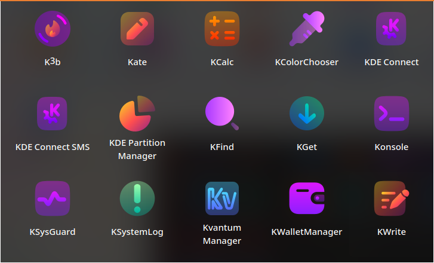
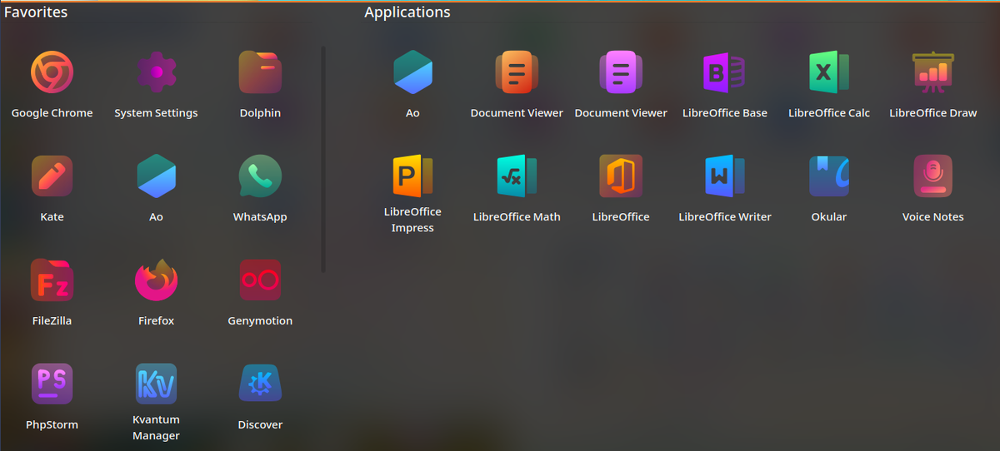

# BeautySolar Icon Theme

Solar-look icon theme for Linux desktops, based on BeautyLine.

**Upstream author:** Sajjad Abdollahzadeh — [KDE Store](https://store.kde.org/p/2037657)  
**License:** GPL-3.0-only (see [BeautySolar/COPYING](BeautySolar/COPYING))

This repository is a canonical mirror to enable reproducible packaging and auditable provenance.




## Installation

### From the AUR

```bash
paru -S beautysolar-icon-theme
```

### Manual

```bash
cp -r BeautySolar ~/.local/share/icons/
```

Then select **BeautySolar** in your desktop environment's appearance settings.

## Attribution

BeautySolar was created by Sajjad Abdollahzadeh and is based on BeautyLine.
This mirror preserves the original work and authorship as required by the GPL-3.0 license.
